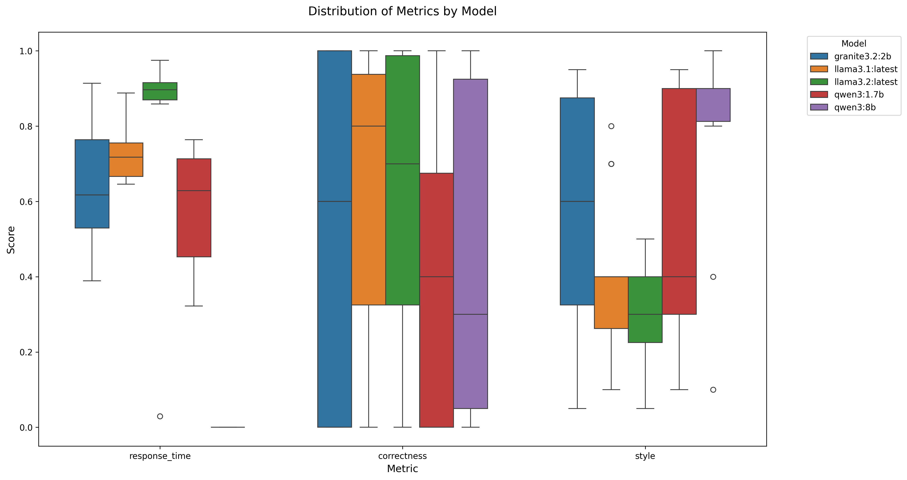

# Medical Chatbot

A medical domain-specific chatbot implementation with two distinct architectures: LangChain-based for evaluation and prompt engineering, and CrewAI-based for agentic AI demonstration. The system includes a comprehensive evaluation framework for assessing different LLM models and prompt configurations.


This image is generated by ChatGPT

## Architecture Overview

### 1. LangChain Implementation
- **Core Components**:
  - Document Processing Pipeline
  - Vector Store Integration (FAISS)
  - Retrieval-Augmented Generation (RAG)
  - Custom Chain Implementations
  - Evaluation Framework

- **Key Features**:
  - Document chunking and embedding
  - Semantic search capabilities
  - Context-aware response generation
  - Prompt template management
  - Automated evaluation pipeline

### 2. CrewAI Implementation
- **Core Components**:
  - Multi-agent System
  - Task Orchestration
  - Role-based Specialization
  - Inter-agent Communication

- **Key Features**:
  - Agent-based conversation flow
  - Task delegation and coordination
  - Specialized medical knowledge agents
  - Dynamic conversation management

## Technical Requirements

- Python 3.10+
- CUDA-compatible GPU (recommended)
- 16GB+ RAM
- 50GB+ storage for model weights and vector store

## Installation

1. Clone and setup:
```bash
git clone https://github.com/yourusername/medical_chatbot.git
cd medical_chatbot
python -m venv .venv
source .venv/bin/activate  # Windows: .venv\Scripts\activate
```

2. Install dependencies:
```bash
pip install -r requirements.txt
```

3. Environment Configuration:
```bash
# Required environment variables
OPENAI_API_KEY=your_key_here
ANTHROPIC_API_KEY=your_key_here
HUGGINGFACE_API_KEY=your_key_here
```

## Usage

The project uses Makefile for common operations:

### LangChain Version
```bash
# Start the chatbot
make chatbot_langchain

# Generate evaluation dataset
make eval_dataset

# Launch evaluation web interface
make eval_app

# Run batch evaluation
make eval_batch
```

### CrewAI Version
```bash
# Start the agentic chatbot
make chatbot_crewai
```

## Evaluation Framework

### 1. Response Quality Metrics
- [x] Relevance: Semantic alignment with query intent
- [x] Coherence: Logical flow and consistency
- [x] Accuracy: Factual correctness and precision

### 2. Performance Metrics
- [x] Response Time: Latency measurements
- [ ] Resource Utilization: Memory and CPU profiling
- [ ] Error Rates: Failure analysis

### 3. User Experience Metrics
- [ ] User Feedback: Structured feedback collection
- [ ] Friendliness and Engagement: Interaction quality
- [ ] Knowledge Adaptation: User expertise level handling

## Model Performance Analysis

We have conducted extensive evaluation of various open-source LLM models across multiple dimensions:



Detailed performance analysis and methodology can be found in [Open Source Model Performance](docs/opensource_model_performance.md).

### Key Findings:
1. Model Performance Comparison
   - Response Quality
   - Latency Analysis
   - Resource Efficiency
   - Error Patterns

2. Prompt Engineering Impact
   - Template Effectiveness
   - Context Utilization
   - Response Consistency

3. System Architecture Considerations
   - Scalability
   - Resource Requirements
   - Integration Complexity

## Development Guidelines

### Code Structure
```
medical_chatbot/
├── src/
│   ├── chatbot_langchain/
│   │   ├── app.py
│   │   ├── chains/
│   │   ├── prompts/
│   │   └── evaluation/
│   └── chatbot_crewai/
│       ├── main.py
│       ├── agents/
│       └── tasks/
├── docs/
│   ├── figs/
│   └── opensource_model_performance.md
├── tests/
└── Makefile
```

### Best Practices
1. Code Organization
   - Modular architecture
   - Clear separation of concerns
   - Comprehensive documentation

2. Testing
   - Unit tests for core components
   - Integration tests for workflows
   - Performance benchmarks

3. Documentation
   - API documentation
   - Architecture diagrams
   - Usage examples

## Contributing

1. Fork the repository
2. Create a feature branch
3. Implement changes with tests
4. Submit a pull request

## Contact

For technical inquiries: sungcheol.kim78@gmail.com
