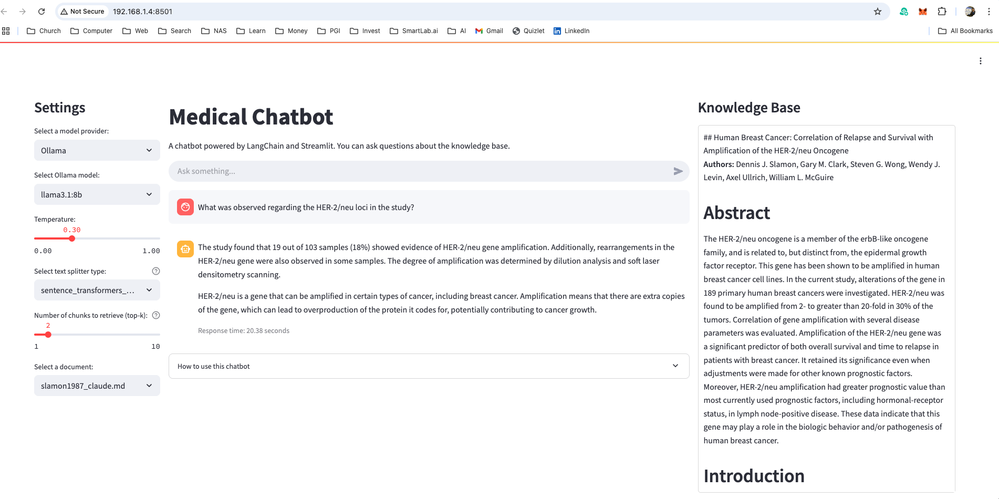
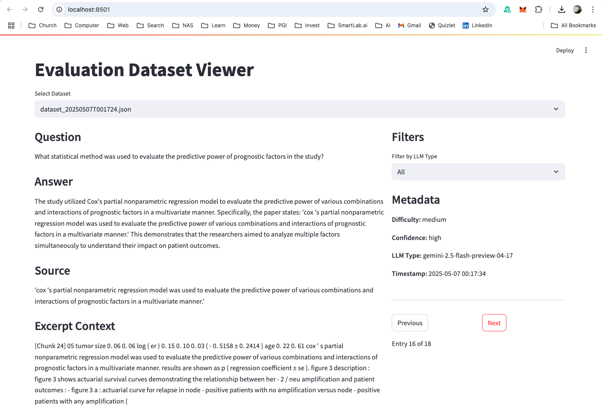
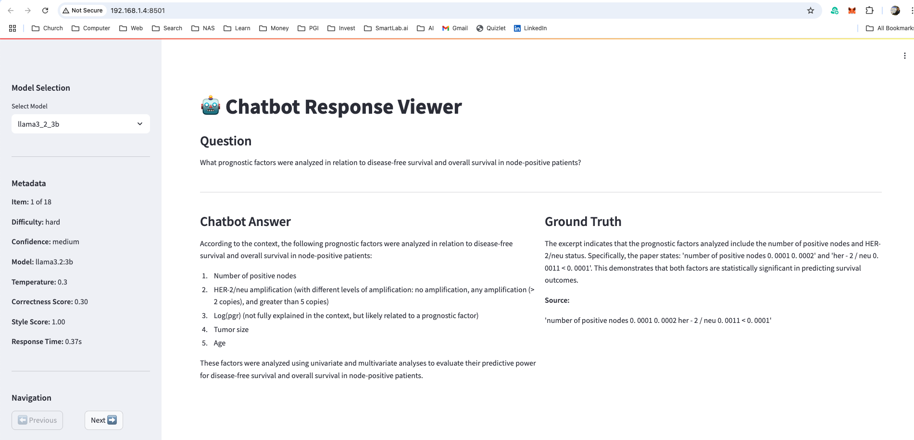
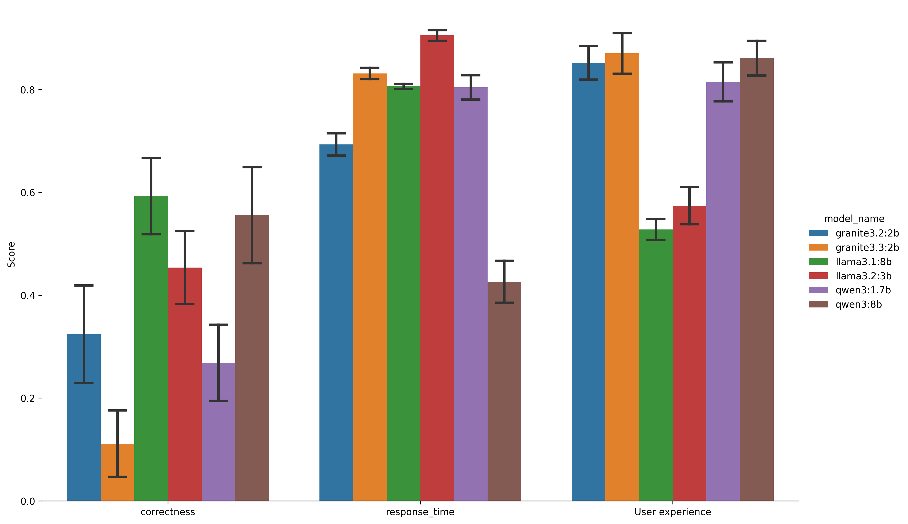

# Medical Chatbot

[](https://www.python.org/downloads/)
[](LICENSE)
[]()

A medical domain-specific chatbot implementation with two distinct architectures: LangChain-based for evaluation and prompt engineering, and CrewAI-based for agentic AI demonstration. The system includes a comprehensive evaluation framework for assessing different LLM models and prompt configurations.

## Table of Contents
- [Project Requirements](#project-requirements)
- [Architecture Overview](#architecture-overview)
- [Installation](#installation)
- [Quick Start](#quick-start)
- [Usage](#usage)
- [Evaluation Framework](#evaluation-framework)
- [Model Performance Analysis](#model-performance-analysis)
- [Future Works](#future-works)
- [Development Guidelines](#development-guidelines)
- [Contributing](#contributing)
- [Contact](#contact)

<div align="center">

<p><em>(This image is generated by ChatGPT)</em></p>
</div>

## Project Requirements

The details of the project requirements can be found [here](docs/project_requirements.md)

## Architecture Overview

### 1. LangChain Implementation

- **Core Components**:
  - Document Processing Pipeline (Docling, VLM)
  - Vector Store Integration (FAISS)
  - Retrieval-Augmented Generation (RAG)
  - Custom Chain Implementations (LangGraph)
  - Evaluation Framework

- **Key Features**:
  - Document chunking and embedding
  - Semantic search capabilities
  - Context-aware response generation
  - Prompt template management
  - Automated evaluation pipeline

The details of the architectural design can be found [here](docs/architectural_design.md)

### 2. CrewAI Implementation

This implementation is premature. However, to demonstrate the difference between the agentic AI approach and conditional flow LLM pipeline, we include the chatbot version implemented by CrewAI. It provides basic chatbot functionality based on the knowledge base, but there is no evaluation pipeline.

- **Core Components**:
  - Multi-agent System (Researcher, Assistant)
  - Task Orchestration (research_task, chat_task)
  - Role-based Specialization
  - Inter-agent Communication

- **Key Features**:
  - Agent-based conversation flow
  - Task delegation and coordination
  - Specialized medical knowledge agents (CrewAI Knowledge)
  - Usually takes long time for the final response (>20 seconds)
  
## Installation

### Prerequisites
- Python 3.9 or higher
- Git
- Virtual environment (recommended)
- Ollama (for local LLM support)

### Setup Steps

1. Clone and setup:
```bash
git clone https://github.com/sungcheolkim78/chatbot-medical.git
cd chatbot-medical
python -m venv .venv
source .venv/bin/activate  # Windows: .venv\Scripts\activate
```

2. Install dependencies:
```bash
pip install -r requirements.txt
```

3. Environment Configuration:
Create a `.env` file by copying `env_example`:
```bash
cp env_example .env
```
Update the following API keys in `.env`:
- `OPENAI_API_KEY`: For evaluation dataset generation
- `ANTHROPIC_API_KEY`: For evaluation dataset generation
- `GOOGLE_API_KEY`: For chatbot response evaluation purposes

> **Note**: These API keys are only required for the evaluation framework and dataset generation. The main chatbot implementation uses open-source models through Ollama, making it possible to run the system without any external API dependencies.

4. Install and download open-source LLMs:
For the ollama and LLM setup, please check [this document](docs/ollama_installation.md)

## Quick Start

To get started quickly with the LangChain version:

```bash
# Activate virtual environment
source .venv/bin/activate

# Start the chatbot
make chatbot_langchain
```

For more detailed usage instructions, see the [Usage](#usage) section below.

## Usage

The project uses Makefile for common operations:

### LangChain Version
```bash
source .venv/bin/activate

# Start the chatbot
make chatbot_langchain

# Generate evaluation dataset
make eval_dataset

# Launch evaluation dataset viewer
make eval_dataset_app

# Run batch evaluation
make eval_batch

# Launch LLM score viewer
make eval_score_app
```

### CrewAI Version
```bash
# Start the agentic chatbot
make chatbot_crewai
```

## Screenshot of the web applications

Chatbot (Langchain version) 

: The main chatbot application


Dataset Viewer 

: The dataset viewer to validate the evaluation dataset with the source excerpts


Chatbot Score Viewer 

: The chatbot response viewer with LLM Judge score


## Evaluation Framework

To enable continuous improvement of the chatbot, we've developed a comprehensive evaluation framework. The framework is built on a carefully curated knowledge base from the seminal paper "Human Breast Cancer: Correlation of Relapse and Survival with Amplification of the HER-2/neu Oncogene". This focused domain allows us to establish clear benchmarks and measure performance improvements. For details on how we process and prepare this knowledge base, see our [preprocessing guide](docs/preprocess.md).

And here are the three main metrics for the evaluation. Check marks indicate implemented items and empty items are for future work. Currently all these metrics are scored by the SOTA LLM (Gemini-2.5-flash) independently. Human in the loop can be implemented through the feedback. Detailed evaluation dataset generation and score calculation can be found [here](docs/evaluation.md)

By continuously updating the prompts and measuring the metric improvement, we can improve the chatbot system incrementally. You can find the details of the continuous development [here](docs/continuous_development.md)

### 1. Factuality Metrics (Correctness)
- [x] Accuracy: Factual correctness and precision
- [x] Relevance: Semantic alignment with query intent
- [x] Coherence: Logical flow and consistency with given knowledge base

### 2. Performance Metrics (Response Time)
- [x] Response Time: Latency measurements
- [ ] Resource Utilization: Memory and CPU profiling
- [ ] Error Rates: Failure analysis

### 3. User Experience Metrics (Style)
- [x] Friendliness and Engagement: Interaction quality
- [x] Knowledge Adaptation: User expertise level handling
- [ ] User Feedback: Structured feedback collection

## Model Performance Analysis

We performed a comprehensive evaluation of multiple open-source LLM models across several key metrics: correctness, response time, and user experience. Error bars in the results represent the standard error calculated from three independent chatbot trials and 18 question/answer sets. A detailed description of the performance analysis and evaluation methodology is available in the [Model Performance](docs/model_performance.md) documentation.



### Conclusions:

1. Model Performance Analysis
   - Llama 3.1 (8B) achieved highest correctness (0.72) with balanced style (0.67) and good response time (0.80)
   - Qwen 3 (8B) showed strong reasoning (0.46 correctness) and excellent style (0.92) with moderate response time (0.40)
   - Smaller models (2-3B) maintained good response times (0.87-0.65) but lower correctness (0.30-0.40)
   - All models met performance targets with response times between 0.1-15 seconds

2. Performance Metrics Distribution
   - Correctness: Larger models (8B) show more consistent and higher correctness scores
   - Response Time: Smaller models (2-3B) show better response time performance (0.87-0.65)
   - Style: Most models maintain good style scores (>0.65), with Qwen models showing highest consistency

3. Model Selection Recommendations
   - For Optimal Performance (Recommended):
     * Use Llama 3.1 (8B) for initial answer generation to ensure high accuracy
     * Follow with Qwen 3 (8B) for response reformatting to enhance user experience
     * This combination leverages Llama's high correctness (0.72) and Qwen's excellent style (0.92)
   
   - For Resource-Constrained Environments:
     * Smaller models (2-3B) provide fastest response times (0.87-0.65)
     * Suitable for applications where speed is critical
     * Trade-off: Lower correctness scores (0.30-0.40)
   
   - For Single-Model Solutions:
     * High Accuracy Focus: Llama 3.1 (8B) offers best correctness with balanced performance
     * User Experience Focus: Qwen 3 (8B) provides excellent style with good overall performance

## Future Works

### 1. Integration of Unified Clinical Vocabulary Embeddings (ClinVec)

The current chatbot system's single-document knowledge base presents a significant limitation in handling multiple medical publications effectively. To address this, we propose a hierarchical retrieval architecture that leverages Unified Clinical Vocabulary Embeddings (ClinVec) through two distinct approaches: document-level and chunk-level retrieval methods. You can find the details [here](docs/clinvec.md).

### 2. Prompt engineering through continuous evaluation pipeline

### 3. Improving RAG system

- Try different LLM models
- Try different vector database (Milvus, Weaviate, Qdrant, Chroma)
- Parameter tuning on chunk size, chunk overlap, and text split strategy

### 4. Explore Agentic AI for research report generation

## Development Guidelines

### Code Structure
```
medical_chatbot/
├── src/                      # Source code directory
│   ├── chatbot_langchain/    # LangChain implementation
│   │   ├── app.py            # Main application entry point
│   │   ├── batch.py          # Batch processing utilities
│   │   └── components/       # Core components and utilities
│   └── chatbot_crewai/       # CrewAI implementation
│       ├── main.py           # Main application entry point
│       ├── crew.py           # Crew configuration
│       └── config/           # Configuration files
├── knowledge/                # Knowledge base directory
│   ├── slamon1987.pdf        # Original research paper
│   └── slamon1987_claude.md  # Processed knowledge base
├── evaluation/               # Evaluation framework
│   ├── configs/              # Evaluation configurations
│   ├── chatbot_results/      # Evaluation results
│   ├── datasets/             # Evaluation datasets
│   ├── components/           # Evaluation components
│   ├── dataset_generator.py  # Dataset generation utilities
│   ├── app_eval.py           # Evaluation application
│   └── llm_scorer.py         # LLM scoring utilities
├── docs/                     # Documentation
│   ├── figs/                 # Figures and diagrams
│   └── README.md             # Documentation files
├── tests/                    # Test suite
├── README.md                 # Project documentation
└── Makefile                  # Build and utility commands
```

## Contributing

1. Fork the repository
2. Create a feature branch
3. Implement changes with tests
4. Submit a pull request

## Contact

For technical inquiries: sungcheol.kim78@gmail.com
