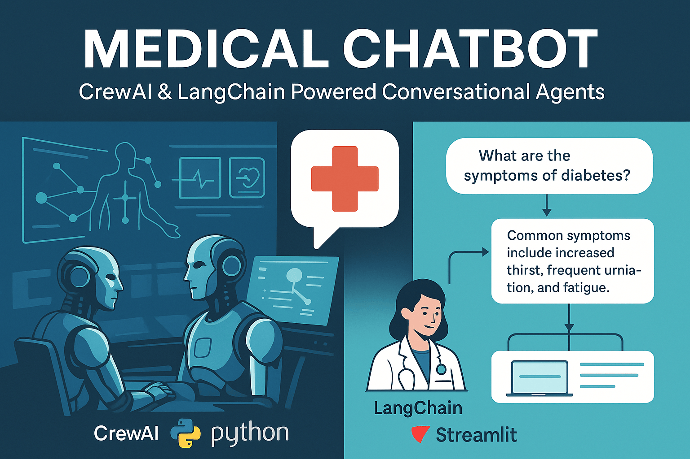

# Medical Chatbot

A medical domain-specific chatbot implementation with two distinct architectures: LangChain-based for evaluation and prompt engineering, and CrewAI-based for agentic AI demonstration. The system includes a comprehensive evaluation framework for assessing different LLM models and prompt configurations.


(This image is generated by ChatGPT)

## Project Requirements

The details of the project requirements can be found [here](docs/project_requirements.md)

## Architecture Overview

### 1. LangChain Implementation

- **Core Components**:
  - Document Processing Pipeline
  - Vector Store Integration (FAISS)
  - Retrieval-Augmented Generation (RAG)
  - Custom Chain Implementations
  - Evaluation Framework

- **Key Features**:
  - Document chunking and embedding
  - Semantic search capabilities
  - Context-aware response generation
  - Prompt template management
  - Automated evaluation pipeline

The details of the architectural design can be found [here](docs/architectural_design.md)

### 2. CrewAI Implementation

This implementation is premature. However, to demonstrate the difference between the agentic AI approach and conditional flow LLM pipeline, we include the chatbot version implemented by CrewAI. It provides basic chatbot functionality based on the knowledge base, but there is no evaluation pipeline.

- **Core Components**:
  - Multi-agent System
  - Task Orchestration
  - Role-based Specialization
  - Inter-agent Communication

- **Key Features**:
  - Agent-based conversation flow
  - Task delegation and coordination
  - Specialized medical knowledge agents
  
## Installation

1. Clone and setup:
```bash
git clone https://github.com/sungcheolkim78/chatbot-medical.git
cd chatbot-medical
python -m venv .venv
source .venv/bin/activate  # Windows: .venv\Scripts\activate
```

2. Install dependencies:
```bash
pip install -r requirements.txt
```

3. Environment Configuration:
Copy env_example to `.env` file and update the API keys.
`OPENAI_API_KEY`, `ANTHROPIC_API_KEY`, `GOOGLE_API_KEY` are used only for evaluation
dataset generation and chatbot response evaluation.

4. Install and download open-source LLMs:
Here, we use Ollama for the local LLM provider with open-source LLMs. 
For the setup, please check [this document](docs/ollama_installation.md)

## Usage

The project uses Makefile for common operations:

### LangChain Version
```bash
source .venv/bin/activate

# Start the chatbot
make chatbot_langchain

# Generate evaluation dataset
make eval_dataset

# Launch evaluation dataset viewer
make eval_dataset_app

# Run batch evaluation
make eval_batch

# Launch LLM score viewer
make eval_score_app
```

### CrewAI Version
```bash
# Start the agentic chatbot
make chatbot_crewai
```

## Screenshot of the web application

Chatbot (Langchain version) - The main chatbot application


Dataset Viewer - The dataset viewer to validate the evaluation dataset with the source excerpts


Chatbot Score Viewer - The chatbot response viewer with LLM Judge score


## Evaluation Framework

We developed a tool to evaluate the chatbot performance so that continuous improvement can be possible. The initial step is to clean up the information for the knowledge base. We are using the seminal paper "Human Breast Cancer: Correlation of Relapse and Survival with Amplification of the HER-2/neu Oncogene". You can find the details of how to preprocess the PDF [here](knowledge/README.md).

And here are the three main metrics for the evaluation. Check marks indicate implemented items and empty items are for future work.

### 1. Response Quality Metrics (Correctness)
- [x] Relevance: Semantic alignment with query intent
- [x] Coherence: Logical flow and consistency
- [x] Accuracy: Factual correctness and precision

### 2. Performance Metrics (Response Time)
- [x] Response Time: Latency measurements
- [ ] Resource Utilization: Memory and CPU profiling
- [ ] Error Rates: Failure analysis

### 3. User Experience Metrics (Style)
- [ ] User Feedback: Structured feedback collection
- [x] Friendliness and Engagement: Interaction quality
- [x] Knowledge Adaptation: User expertise level handling

Detailed evaluation dataset generation and score calculation can be found [here](evaluation/README.md)

## Model Performance Analysis

We have conducted extensive evaluation of various open-source LLM models across multiple dimensions:


Detailed performance analysis and methodology can be found in [Open Source Model Performance](docs/opensource_model_performance.md).

By continuously updating the prompts and measuring the metric improvement, we can improve the chatbot system incrementally. You can find the details of the continuous development [here](docs/continous_development.md)

### Key Findings:

1. Factuality Check
   - Response Quality and Correctness based on the base LLM models and prompt engineering
   - Error Patterns

2. Prompt Engineering Impact
   - Template Effectiveness
   - Context Utilization
   - Response Consistency

3. System Architecture Considerations
   - Latency Analysis
   - Scalability
   - Integration Complexity

## Future Works

### Integration of Unified Clinical Vocabulary Embeddings (UCVE)

Based on the methodology presented in [Johnson et al. (2024)](knowledge/johnson2024.pdf), we propose an enhancement to our chatbot system's knowledge retrieval capabilities through the implementation of domain-specific embeddings.

**Key Technical Insights:**

1. Current embedding methodologies (e.g., OpenAI, Voyage) demonstrate suboptimal performance in capturing medical semantic relationships and concept hierarchies.
2. The proposed solution implements a graph network-based transformer architecture with self-supervised learning to generate latent embeddings specifically optimized for clinical terminology.
3. The architecture addresses two critical challenges: data privacy preservation and cross-institutional semantic interoperability.

**Business Value for Healthcare Insurance:**

The implementation of UCVE provides significant advantages for healthcare insurance operations:

1. **Privacy Preservation:**
   - Secure handling of patient data through embedding-based semantic matching
   - No requirement for direct patient information in the training process
   - Compliance with healthcare data protection regulations

2. **Clinical Precision:**
   - Enhanced correlation mapping between medical concepts and disease types
   - Improved accuracy in medical information retrieval
   - Support for precision medicine applications

3. **Operational Efficiency:**
   - Cross-institutional semantic interoperability
   - Standardized medical terminology processing
   - Reduced manual intervention in claims processing

**Technical Implementation Considerations:**

The current system's limitation of single-document knowledge base can be addressed through a hierarchical retrieval architecture. Presently, we utilize FAISS with Hugging Face embeddings for chunk-level semantic search within a single document.

**Proposed Two-Tier Retrieval Architecture:**

1. **Document-Level Retrieval:**
   - Implementation of UCVE at the document level
   - Utilization of embedding additive properties for document representation
   - Cosine similarity-based retrieval of top-k (k ∈ {2,3}) relevant documents
   - Subsequent chunk-level search within retrieved documents

2. **Chunk-Level Retrieval:**
   - Direct application of UCVE to document chunks
   - Construction of a unified chunk database
   - Query-chunk similarity computation for precise information retrieval

**Performance Trade-offs:**

The document-level approach offers superior scalability for large document collections but introduces potential noise in embedding matching. The chunk-level approach provides higher precision but requires significant vector database resources and exhibits higher latency.

## Development Guidelines

### Code Structure
```
medical_chatbot/
├── src/
│   ├── chatbot_langchain/
│   │   ├── app.py
│   │   ├── batch.py
│   │   └── components/
│   └── chatbot_crewai/
│       ├── main.py
│       ├── crew.py
│       └── config/
├── knowledge/
│   ├── slamon1987.pdf
│   └── slamon1987_claude.md
├── evaluation/
│   ├── configs/
│   ├── chatbot_results/
│   ├── datasets/
│   ├── components/
│   ├── dataset_generator.py
│   ├── app_eval.py
│   └── llm_scorer.py
├── docs/
│   ├── figs/
│   └── opensource_model_performance.md
├── tests/
└── Makefile
```

## Contributing

1. Fork the repository
2. Create a feature branch
3. Implement changes with tests
4. Submit a pull request

## Contact

For technical inquiries: sungcheol.kim78@gmail.com
