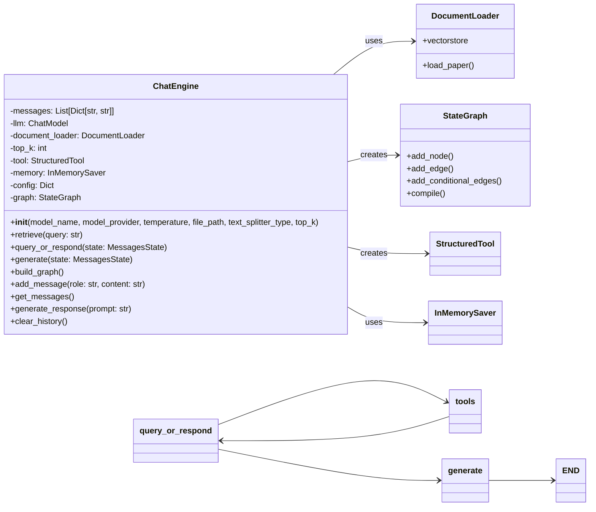

# ChatEngine Architectural Design

## System Overview

The ChatEngine is a sophisticated conversational AI system built using LangChain and LangGraph, designed to provide intelligent responses with context-aware document retrieval capabilities. The system is particularly optimized for medical Q&A tasks, combining the power of large language models with structured knowledge retrieval.

## Architecture Diagram

## Core Components

### 1. ChatEngine
The main orchestrator of the system that manages:
- Conversation state and history
- LLM integration and configuration
- Document retrieval and processing
- Response generation pipeline

### 2. DocumentLoader
Responsible for:
- Loading and processing documents
- Creating and managing vector stores
- Text splitting and embedding
- Knowledge base maintenance

### 3. StateGraph
Manages the conversation flow with:
- Three main nodes: query_or_respond, tools, and generate
- Conditional routing based on tool usage
- State management and transitions
- End-to-end conversation flow control

### 4. StructuredTool
Provides the retrieval functionality:
- Similarity search in the knowledge base
- Context-aware document retrieval
- Integration with the main conversation flow

### 5. InMemorySaver
Handles:
- Conversation state persistence
- Memory management
- State checkpointing

## Data Flow

1. **Input Processing**
   - User query received through `generate_response`
   - Message state initialized with user input

2. **Query Analysis**
   - `query_or_respond` node determines if tool usage is needed
   - Conditional routing based on query complexity

3. **Document Retrieval**
   - When needed, `tools` node activates document retrieval
   - Similarity search performed on vector store
   - Relevant context extracted

4. **Response Generation**
   - `generate` node combines context and query
   - LLM generates appropriate response
   - Response formatted and returned

## Key Features

### 1. Context-Aware Responses
- Intelligent document retrieval
- Context integration in responses
- Medical terminology explanation

### 2. Flexible Architecture
- Configurable LLM integration
- Adjustable retrieval parameters
- Extensible tool system

### 3. State Management
- Conversation history tracking
- Memory persistence
- State checkpointing

### 4. Medical Q&A Optimization
- Specialized system prompts
- Medical context understanding
- Simplified terminology explanation

## Configuration Options

The system can be configured through various parameters:
- Model selection and provider
- Temperature settings
- Document source and processing
- Retrieval parameters (top_k)
- Text splitting strategy

## Future Considerations

1. **Scalability**
   - Distributed document processing
   - Multiple knowledge base support
   - Enhanced caching mechanisms

2. **Enhanced Features**
   - Multi-turn conversation optimization
   - Advanced context management
   - Improved medical terminology handling

3. **Integration Capabilities**
   - API endpoints
   - Web interface
   - External system integration
