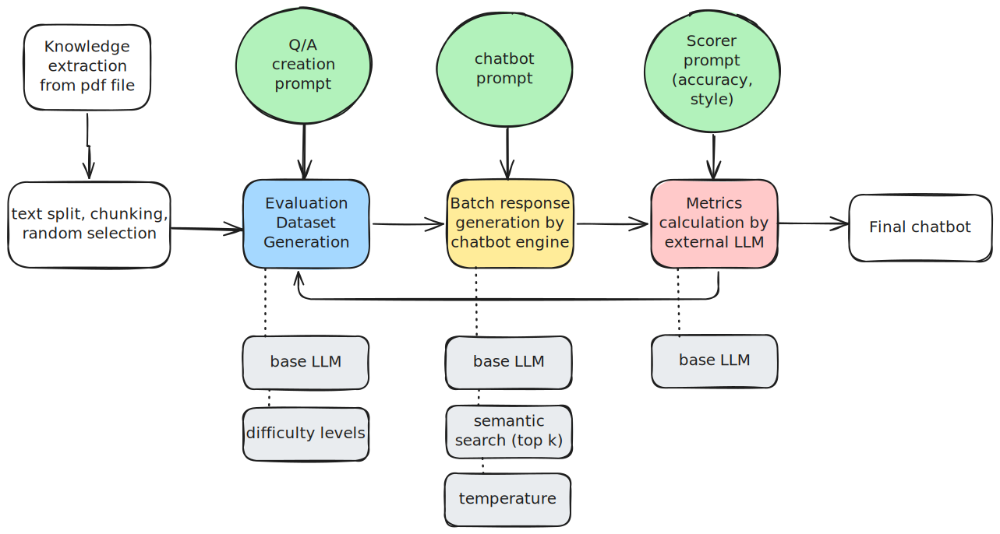

# Medical Chatbot Continuous Development Workflow

This technical document describes the continuous development workflow used for medical chatbot development, as illustrated in the diagram.

## Overview

The workflow represents a systematic approach to developing, evaluating, and refining medical chatbots through a series of interconnected processes. The pipeline integrates knowledge extraction, dataset generation, response evaluation, and performance metrics to ensure the chatbot meets medical accuracy and quality standards.

## Component Breakdown

### 1. Knowledge Extraction & Text Processing
- **Knowledge extraction from PDF file**: Medical knowledge is initially sourced from PDF documentation
- **Text split, chunking, random selection**: Extracted text undergoes preprocessing including:
  - Splitting into manageable segments
  - Chunking related information
  - Random selection of content for diverse training and evaluation

### 2. Evaluation Dataset Generation
- Receives inputs from:
  - Knowledge extraction pipeline
  - Q/A creation prompt (guiding question-answer pair generation)
  - Base LLM (providing foundational language capabilities)
  - Difficulty levels (ensuring varied complexity in test cases)
- Creates a comprehensive dataset for evaluating chatbot performance

### 3. Batch Response Generation
- Utilizes:
  - Chatbot prompt (instructing response generation)
  - Base LLM (providing language capabilities)
  - Semantic search (top k) (retrieving relevant information)
  - Temperature settings (controlling response randomness)
- Processes the evaluation dataset to generate batch responses

### 4. Performance Metrics Calculation
- Employs:
  - Scorer prompt (defining accuracy and style criteria)
  - External LLM (providing objective evaluation)
- Analyzes generated responses against quality benchmarks
- Feeds back into the evaluation dataset generation for continuous improvement

### 5. Final Chatbot
- The end product representing the optimized chatbot after iterative development and evaluation

## Process Flow

1. Medical knowledge is extracted from PDFs and preprocessed
2. This knowledge forms the foundation for creating evaluation datasets
3. The chatbot engine generates responses to the evaluation dataset
4. An external LLM calculates performance metrics based on predetermined criteria
5. Feedback loops ensure continuous improvement:
   - Metrics feed back to refine evaluation datasets
   - The entire pipeline iterates to produce an increasingly accurate medical chatbot

## Technical Considerations

- **Base LLM Integration**: Multiple points in the workflow leverage base LLM capabilities
- **Parameter Tuning**: Difficulty levels, semantic search parameters, and temperature settings allow for fine-tuning
- **Evaluation Criteria**: Scorer prompts define specific medical accuracy and response style requirements
- **Feedback Mechanisms**: Multiple feedback loops enable iterative improvement

This continuous development workflow ensures the medical chatbot undergoes rigorous testing and refinement, maintaining high standards of accuracy and reliability essential for medical applications.