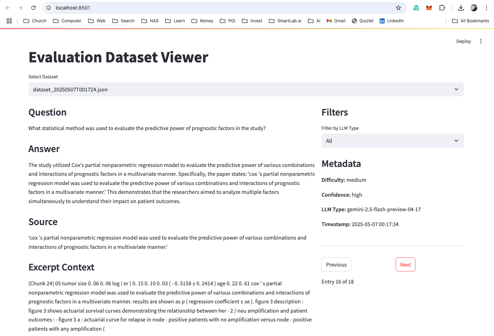

# Evaluation of Chatbot Performance

This document outlines the technical implementation and workflow for evaluating chatbot performance through automated dataset generation and validation.

## Dataset Generation Pipeline

### 1. PDF Processing
- Input: PDF documents containing domain-specific knowledge
- Processing: Utilizes PDF loaders (PyPDF2, PDFMiner, or Unstructured) for text extraction
- Output: Structured text content with preserved formatting and metadata
- Reference: See [knowledge processing documentation](../knowledge/README.md) for detailed implementation

### 2. Text Chunking
- Input: Processed text content from PDF
- Method: Implements sliding window approach with configurable parameters:
  - Chunk size: Default 1000 tokens
  - Chunk overlap: Default 200 tokens
  - Chunking strategy: Sentence-aware splitting
- Output: Overlapping text chunks for context preservation

### 3. Question-Answer Pair Generation
- Input: Text chunks from previous step
- LLM Providers:
  - OpenAI (GPT-4)
  - Anthropic (Claude)
  - Google (PaLM)
- Difficulty Levels:
  - Easy: Direct information extraction
  - Medium: Inference and basic reasoning
  - Hard: Complex reasoning and synthesis
- Output: Structured Q&A pairs with metadata

### 4. Confidence Scoring
- Method: LLM-based self-evaluation
- Scale: 0-1 confidence score
- Factors considered:
  - Answer completeness
  - Information accuracy
  - Reasoning validity

### 5. Dataset Storage
- Format: JSON
- Structure:
```json
{
  "question": "string",
  "answer": "string",
  "source": "string",
  "full_context": "string",
  "difficulty": "easy|medium|hard",
  "confidence": float,
  "llm_type": "openai|anthropic|google",
  "timestamp": "string"
}
```

## Usage

### Dataset Generation
```bash
# Basic usage
make eval_dataset

# Advanced usage with parameters
python evaluation/dataset_generator.py \
  --paper_path /path/to/source.pdf \
  --num_questions 10 \
  --chunk_size 1000 \
  --chunk_overlap 200 \
  --difficulty_levels easy medium hard
```

### Supported Input Formats
1. PDF Files:
   - Uses PyPDF2 for basic PDF processing
   - PDFMiner for enhanced text extraction
   - Unstructured for complex document layouts

2. Markdown Files:
   - Supports OpenAI-generated markdown
   - Supports Anthropic-generated markdown
   - Uses Unstructured markdown loader

### Output Location
Generated datasets are stored in:
```
evaluation/datasets/dataset_{timestamp}.json
```

## Dataset Validation Tool

### Streamlit Application
```bash
make eval_app
```

### Features
1. Interactive Q&A pair review
2. Source document context display
3. Metadata visualization
4. Export capabilities
5. Batch processing support

### Technical Implementation
- Frontend: Streamlit
- Backend: Python
- Data Storage: JSON
- Visualization: Plotly/Matplotlib

### Screenshot


## Quality Metrics
1. Answer Accuracy
2. Question Relevance
3. Difficulty Distribution
4. Confidence Distribution
5. Source Attribution

## Best Practices
1. Generate balanced datasets across difficulty levels
2. Validate Q&A pairs against source material
3. Maintain consistent chunking parameters
4. Regular dataset quality reviews
5. Version control for datasets
