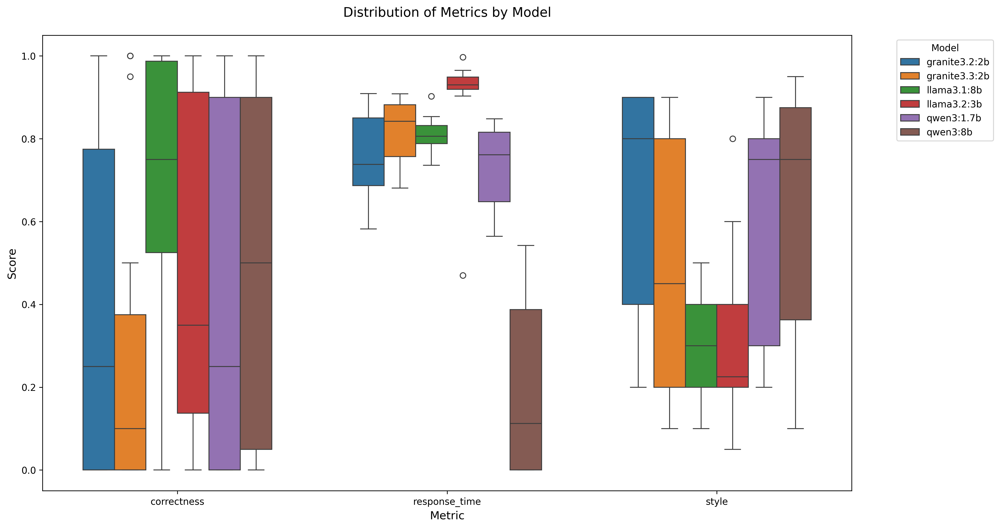

# Open-Source LLM Model Evaluation Framework

## Overview
This framework evaluates open-source LLM models deployed through Ollama with tool capabilities. Our primary focus is on models that can run efficiently on consumer-grade hardware while maintaining strong performance.

## Model Selection Criteria
To ensure practical deployment, we established the following criteria:
- Maximum parameter size: 8B or smaller
- VRAM requirement: Less than 10GB
- Model quantization: Q4_K_M format for optimal memory efficiency and speed

### Selected Models
We evaluated the following models based on their unique strengths:

| Model | Parameter Size | Selection Rationale |
|-------|---------------|-------------------|
| Llama 3.1 | 8B | Baseline open-source LLM |
| Llama 3.2 | 3B | Efficient baseline variant |
| Granite 3.2 | 2B, 8B | High RAG system performance |
| Qwen 3 | 1.7B, 8B | Strong reasoning capabilities |

## Evaluation Framework

### Key Performance Indicators (KPIs)
We assess model performance across three primary dimensions:

1. **Factuality Score**
   - Measures response accuracy against ground truth
   - Uses annotated question-answer pairs
   - Categorizes by knowledge complexity (easy, medium, hard)

2. **User Experience Score**
   - Evaluates response quality and relevance
   - Assesses conversation quality and interaction patterns
   - Uses external evaluation via state-of-the-art LLM

3. **Performance Score**
   - Measures end-to-end response latency
   - Scoring scale:
     - 1.0: Optimal response time (0.1s)
     - 0.0: Maximum acceptable time (15s)
     - Linear interpolation for intermediate values

## Performance Comparison

The following table presents the quantitative comparison of model performance:

| Model | Parameter Size | Correctness | Style | Response Time | Notes |
|-------|---------------|----------|-----------|-----------|-------|
| Llama 3.1 | 8B | 0.72 | 0.67 | 0.78 | |
| Llama 3.2 | 3B | 0.61 | 0.83 | 0.87 | |
| Granite 3.2 | 2B | 0.13 | 0.98 | 0.64 | |
| Granite 3.2 | 8B | 0.13 | 0.98 | 0.64 | |
| Qwen 3 | 1.7B | 0.33 | 0.97 | 0.65 | Reasoning-focused model |
| Qwen 3 | 8B | 0.46 | 0.92 | 0.25 | Reasoning-focused model |

1. Llama 3.1 (8B) shows good correctness (0.72) and decent style (0.67), with moderate response time (0.78)
1. Llama 3.2 (3B) has slightly lower correctness (0.61) but better style (0.83), with slightly faster response time (0.87)
1. Granite 3.2 (both 2B and 8B) shows lower correctness (0.13) but excellent style (0.98), with good response times (0.64)
1. Qwen 3 (1.7B) shows moderate correctness (0.33) with excellent style (0.97) and moderate response time (0.65)
1. Qwen 3 (8B) shows better correctness (0.46) than its smaller version, with excellent style (0.92) and the slowest response time (0.25)

## Visual Analysis

The comparative performance metrics across models are visualized in the following boxplot:

After updating the LLM scoring prompt, the evaluation score were changed.

